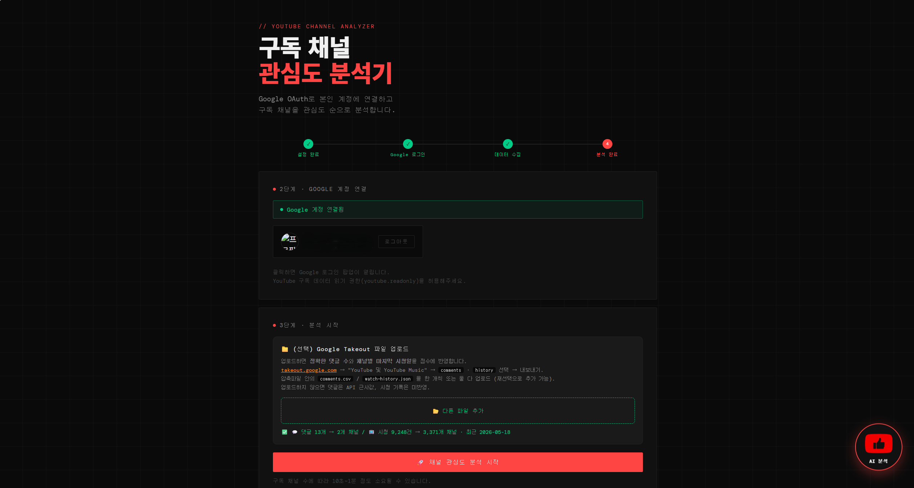
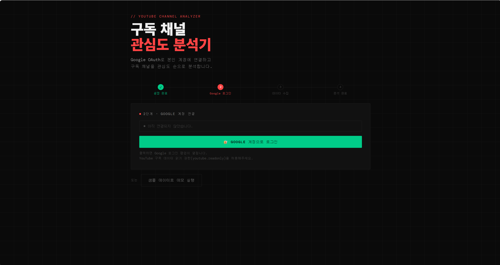
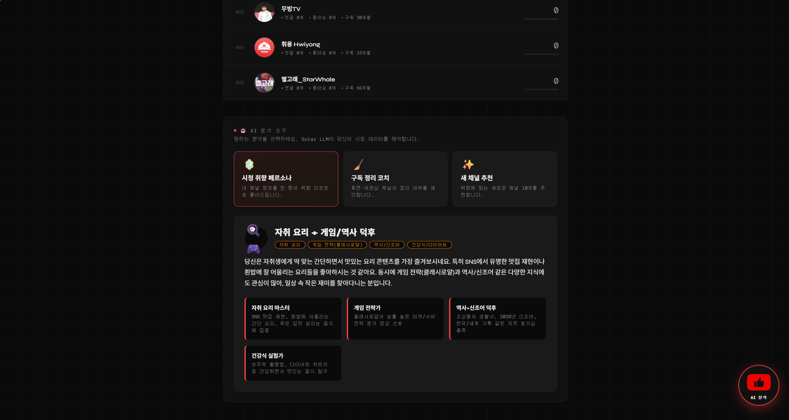

# 📺 YouTube Channel Interest Analyzer

A single-page web application that, after connecting to your own account via Google OAuth, synthesizes your subscribed channels by **comments · likes · subscription duration** into an interest score (0–100) and automatically classifies and displays them in 4 groups (🔥/😊/👋/🌱).

The server uses Flask, the frontend uses Vanilla JS, and authentication uses the Google Identity Services (GIS) token client.

---

## Table of Contents

- [Demo Screens](#demo-screens)
- [Execution Flow](#execution-flow)
- [Installation & Running](#installation--running)
- [Google Cloud Console Setup](#google-cloud-console-setup)
- [Two Operating Modes](#two-operating-modes)
- [Folder Structure](#folder-structure)
- [API Endpoints](#api-endpoints)
- [Scoring Algorithm](#scoring-algorithm)
- [Takeout Strategy (comments + watch history)](#takeout-strategy-comments--watch-history-hybrid)
- [List of Algorithms Actually Used](#list-of-algorithms-actually-used)
- [Quota & Constraints](#quota--constraints)
- [License](#license)

---

## Demo Screens

> Log in with Google OAuth → analyze subscribed channels **by interest order** → **AI analysis tools** and a **taste graph**, all on one screen.



---

## Execution Flow

```
[User]
   │
   ├── Step 1: enter OAuth client ID (or skip via server env injection)
   ├── Step 2: Google account login (GIS token client)
   │       └─ scope: youtube.readonly, userinfo.profile, userinfo.email
   ├── Step 3: (optional) Google Takeout upload
   │       ├─ comments.csv         → exact per-channel comment count
   │       └─ watch-history.json   → per-channel watch count + last watch date
   └── Step 4: start analysis
              ↓
      [Browser]   YouTube Data API v3
              ↓
        - subscriptions.list?mine=true         (subscription list)
        - channels.list?mine=true              (my channel ID)
        - videos.list?myRating=like            (liked videos)
        - commentThreads.list?allThreadsRelatedToChannel  (API approximation when comments not uploaded)
        - videos.list?id=...                   (video→channel resolution when comments.csv uploaded)
              ↓
      [Flask /api/analyze]
              ↓
        LRU cache (input-dependent key) → activity summation (dormant 0-point short-circuit)
              → Recency Decay (when watch history present)
              → Min-Max normalization → Binary Search 4-group classification
              → Heap Sort descending
              ↓
      [Browser]  result rendering + filters/summary
```

| Steps 1·2 — client ID setup & Google login | Step 3 — (optional) Takeout upload |
|:---:|:---:|
|  |  |

---

## Installation & Running

### Prerequisites

- Python 3.10+ (verified environment: 3.14)
- A browser with internet access
- Your own Google Cloud Console project (1 OAuth client)

### Install packages

```powershell
python -m pip install flask
```

### Run the server (manual mode)

```powershell
cd "Liberal_algorithm"
python app.py
```

Default port is 5000. Visit http://127.0.0.1:5000/.

### Run the server (automatic mode: client ID pre-injected)

One-line PowerShell (session-only):

```powershell
$env:GOOGLE_CLIENT_ID = "YOUR_ID.apps.googleusercontent.com"
python app.py
```

Permanent setting:

```powershell
[System.Environment]::SetEnvironmentVariable('GOOGLE_CLIENT_ID', 'YOUR_ID.apps.googleusercontent.com', 'User')
```

You can confirm automatic/manual mode from the server startup logs.

```
[config] GOOGLE_CLIENT_ID detected (...lastchars) -> automatic OAuth mode
[config] GOOGLE_CLIENT_ID not set -> user enters the client ID manually
```

---

## Google Cloud Console Setup

1. Go to [Google Cloud Console](https://console.cloud.google.com) → create a new project
2. Enable **APIs & Services → Library → YouTube Data API v3**
3. Configure the **OAuth consent screen**
   - Add the scopes `https://www.googleapis.com/auth/youtube.readonly`, `userinfo.profile`, `userinfo.email`
   - Add your own Gmail as a test user (or publish to production)
4. **Credentials → Create OAuth client ID**
   - Type: **Web application**
   - Add both of the following to **Authorized JavaScript origins**
     - `http://localhost:5000`
     - `http://127.0.0.1:5000`
   - (Also add your production domain if deploying)
   - Copy the client ID

> 💡 Because this uses the GIS token client approach, the **client secret is not needed and must not be registered or exposed**. No API key is used either (all YouTube Data API calls work with the OAuth Bearer token alone).

---

## Two Operating Modes

| Mode | User input | Trigger | UX |
|---|---|---|---|
| Manual | 1 client ID | env not set | Shows the Step-1 input card |
| Automatic | 0 | env `GOOGLE_CLIENT_ID` set | Skips Step 1 automatically, goes straight to the Google login button |

In automatic mode, Flask inlines `window.__APP_CONFIG__.clientId` into the HTML via Jinja2 ([app.py:172](app.py#L172), [youtube-analyzer.html:163](static/youtube-analyzer.html#L163)).

---

## Folder Structure

```
Liberal_algorithm/
├── app.py                       # Flask server + scoring algorithms
├── README.md
└── static/
    ├── youtube-analyzer.html    # SPA markup (also used as a Jinja2 template)
    ├── style.css                # dark theme + grid background
    └── app.js                   # OAuth, API collection, Takeout parsing, rendering
```

Flask uses the same folder for both static assets and templates via `static_folder="static"` + `template_folder="static"`.

---

## API Endpoints

| Method | Path | Description |
|---|---|---|
| GET | `/` | Main SPA (`youtube-analyzer.html`, `client_id` inlined) |
| POST | `/api/analyze` | Takes a channel array and scores/sorts/group-classifies it |
| GET | `/api/demo` | Demonstrates the same pipeline with 15 sample channels |
| POST | `/api/interest_keywords` | (LLM) extracts search keywords for discovering new channels from top channels · recent video titles |
| POST | `/api/curate` | (LLM) selects and ranks channels matching the user's taste from a **real channel pool discovered via video search** |
| POST | `/api/recommend` | (LLM) recommendation by directly generating channel names — fallback path when discovery fails / not logged in |
| POST | `/api/verify_recommend` | (LLM) corrects classification/rationale using the fallback channels' **real descriptions · video titles** and excludes taste-mismatched ones |
| POST | `/api/persona` | (LLM) interprets the score/category distribution as a viewing-taste persona report |
| POST | `/api/cleanup` | (LLM) suggests whether to clean up dormant / low-interest channels scoring under 20 |

> The above LLM endpoints call Upstage Solar (`solar-pro2`), so `UPSTAGE_API_KEY` in `.env` is required. Use the three modes from the **🤖 AI Analysis Tools** section of the results screen (or the floating button at the bottom-right).

| Viewing-taste persona (`/api/persona`) | Subscription cleanup coach (`/api/cleanup`) |
|:---:|:---:|
|  |  |

### New-channel recommendation — video-first discovery

If the LLM makes up channel names directly, it falls into the trap of recommending **non-existent channels (hallucinations)** or **channels whose description differs from what they actually upload**. So recommendation works by "not searching for channels by name, but searching for videos about an interest and reverse-collecting the real channels that uploaded those videos" ([app.js](static/app.js) `runRecommend`).

```
① Extract interest keywords      /api/interest_keywords  (top channels + recent video titles)
② Per-keyword video search        search.list?type=video  → collect each video's channelId (100 units per keyword)
③ Aggregate channelId frequency   appearing in 2+ keywords = genuinely a channel on that topic (exclude already-subscribed)
④ Candidate profiling             channels.list + uploads playlistItems  (all 1 unit, real description · video titles)
⑤ LLM curation                    /api/curate  → rank · reason · fit judgment from real info, top up by frequency if lacking
```

The expensive `search.list` (100 units) is used only once per keyword in ② (max 8 = 800 units), and deep profiling (④) is handled by 1-unit endpoints to save quota. If not logged in (demo) or discovery candidates are thin, it switches to the fallback path where the LLM directly generates channel names (`/api/recommend` → `/api/verify_recommend`).


It also reflects not just the subscription list but also the **recent watch history** (Takeout `watch-history`), recommending both *new channels based on taste* and *channels watched recently but not subscribed*. It derives interests via category classification and recommends diversely **at least one per category** such as cooking · economics · gaming.

| ✨ Taste-based new-channel recommendation | 📺 Watched recently but not subscribed |
|:---:|:---:|
|  |  |

Example POST request body:
```json
{
  "channels": [
    {
      "id": "UC...", "name": "...",
      "subMonths": 36,
      "comments": 50,
      "likes": 200,
      "watchCount": 120,
      "lastWatchDays": 5
    }
  ]
}
```

`watchCount` and `lastWatchDays` are optional fields (filled only when Takeout `watch-history` is uploaded).

Response:
```json
{ "channels": [{ ..., "score": 92, "group": { "label": "🔥 Favorite channel", "cls": "score-top", "bar": "bar-top" } }] }
```

---

## Scoring Algorithm

A 5-stage pipeline is applied in order in `analyze_channels()` at [app.py:145-167](app.py#L145-L167).

### 1) Activity-based raw score (weighted sum + dormant 0-point short-circuit)

[app.py:57-67](app.py#L57-L67):

```python
def calc_raw_score(ch):
    activity = (ch.get("comments", 0) * 5) \
             + (ch.get("likes", 0)    * 2) \
             + (ch.get("watchCount", 0) * 3)
    if activity == 0:
        return 0  # activity 0 → dormant channel immediately scores 0
    sub_bonus = min(ch.get("subMonths", 0), 24) * 0.5
    return activity + sub_bonus
```

| Signal | Weight | Rationale |
|---|---:|---|
| Comment count | ×5 | Writing is the most active form of engagement |
| Watch count (Takeout) | ×3 | Actually watching is a strong preference signal |
| Like count | ×2 | One click, a medium signal |
| Long-term subscription bonus | +`min(months, 24) × 0.5` | Up to 12 points, added only when there is activity |

Key changes:
- **If the activity sum (comments + likes + watches) is 0, the score is 0 regardless of any other value.** A channel "subscribed for 10 years but not watched" is demoted to dormant.
- **Subscription months are no longer added directly to raw.** They act as a bonus only for active channels, capped at 2 years.

### 2) Recency exponential decay (Recency Decay)

[app.py:72-77](app.py#L72-L77):

```python
def apply_recency_decay(score, last_watch_days, lambda_r=0.005):
    if score == 0 or last_watch_days is None:
        return score
    return score * math.exp(-lambda_r * max(0, last_watch_days))
```

Decay proportional to "days elapsed since last watch" obtained from Takeout `watch-history`. Not applied when watch history is not uploaded (`lastWatchDays=None`).

| Last watch | Decay factor $e^{-0.005 d}$ |
|---:|---:|
| 7 days ago | 0.966 |
| 30 days ago | 0.861 |
| 90 days ago | 0.638 |
| 365 days ago | 0.161 |
| 1,095 days (3 years) ago | 0.004 (effectively 0) |

When Takeout exists but a subscribed channel has zero entries in the watch history, `lastWatchDays = subMonths × 30` is set to treat it as "dormant for the entire subscription period."

### 3) Min-Max normalization → 0–100

[app.py:83-89](app.py#L83-L89):

```python
def normalize(scores):
    mn, mx = min(scores), max(scores)
    if mx == mn:
        return [50] * len(scores)
    return [round((s - mn) / (mx - mn) * 100) for s in scores]
```

This is a **relative evaluation**. It is comparable only within the same user's analysis; comparing scores across users is meaningless.

### 4) 4-group classification (Binary Search)

[app.py:122-139](app.py#L122-L139):

| Score range | Label |
|:---:|---|
| 0 ~ 19 | 🌱 Subscribed-only channel |
| 20 ~ 49 | 👋 Occasionally watched channel |
| 50 ~ 79 | 😊 Frequently watched channel |
| 80 ~ 100 | 🔥 Favorite channel |

With only 3 boundaries, linear search would be sufficient, but binary search is implemented for the purpose of demonstrating the algorithm (`O(log k)`).

### 5) Heap Sort descending

[app.py:95-118](app.py#L95-L118). A directly-implemented max-heap-based sort instead of Python `sorted()`.

### 6) LRU cache (input-dependent key)

[app.py:32-49](app.py#L32-L49), [app.py:147-156](app.py#L147-L156). The cache key is the tuple `(id, comments, likes, watchCount, subMonths, lastWatchDays)`, so it is **automatically invalidated when the input changes**. Repeated calls within the same analysis are instant cache hits.

### Integrated example (verified cases)

| Channel | Sub months | Comments | Likes | Watches | Last watch | **Final score** |
|---|---:|---:|---:|---:|---:|---:|
| Watched 150× 3 days ago | 24 | 0 | 0 | 150 | 3 days | **100** |
| 5 years active (comments/likes only) | 60 | 20 | 80 | 0 | — | 60 |
| 6 months active | 6 | 5 | 20 | 0 | — | 15 |
| **10 years dormant** | **120** | **0** | **0** | **0** | — | **0** |
| Watched 50× 1,000 days ago | 60 | 0 | 0 | 50 | 1000 days | 0 |

Under the previous formula, the 10-years-dormant channel ranked higher than the 6-months-active one, but under the new formula it is correctly demoted to **activity 0 → score 0**.

---

## Takeout Strategy (comments + watch history hybrid)

The YouTube Data API has no endpoint to directly query "all comments I've made" / "all videos I've watched" (Google removed the watch-history API in 2016). So [Google Takeout](https://takeout.google.com/) export data is accepted as auxiliary input. **Both types** can be dropped into a single upload box, and they are auto-identified by filename / content.

### 1) Comment counting

**Default (API approximation) ─ [app.js:271-296](static/app.js#L271-L296):**
- Query my channel ID via `channels.list?mine=true`
- For each subscribed channel, call `commentThreads.list?allThreadsRelatedToChannel=<id>&maxResults=100` (10 in parallel)
- Count only top-level comments where `authorChannelId.value == myId` in the response
- **Limit:** Only the latest 100 per channel are scanned → on popular channels your comments may be pushed out and count as 0. Replies are not reflected.

**Takeout override ─ [app.js:521-535](static/app.js#L521-L535), [537-557](static/app.js#L537-L557):**
- Upload `comments.csv` (or `my-comments.html`)
- Extract video IDs via regex → resolve video→channel in batches of 50 via `videos.list?id=ID1,…,ID50&part=snippet`
- Aggregate per-channel counts → store in `takeoutCommentsByChannel`, automatically prioritized during analysis

### 2) Watch history (the key signal of scoring formula v2)

**Not a required input, but it greatly improves accuracy.** When uploaded, `watchCount` + `lastWatchDays` are filled and [recency decay](#2-recency-exponential-decay-recency-decay) is activated.

**JSON format ─ [app.js:560-582](static/app.js#L560-L582):**
- Each entry's `subtitles[0].url` in `watch-history.json` embeds the channelId → **no API call needed**
- Track per-channel first/last watch date from the ISO8601 timestamp in the `time` field
- Compute `{ count, lastDate, firstDate }` per channel

**HTML format (legacy) ─ [app.js:584-594](static/app.js#L584-L594):**
- Count `<a href="https://www.youtube.com/channel/...">` in `watch-history.html` via regex
- Time info is locale-dependent so it is not parsed → `lastDate=null` → `lastWatchDays` is conservatively estimated from the subscription duration

### 3) Integrated branching logic ([app.js:215-265](static/app.js#L215-L265))

```text
[fetchYouTubeData]
  ├─ Takeout watch present? ──── yes ─► fill ch.watchCount, ch.lastWatchDays
  │                              │      if ch not in watch, lastWatchDays = subMonths * 30 (dormant)
  │                              no ─► watchCount=0, lastWatchDays=null (decay not applied)
  │
  └─ Takeout comments present? ── yes ─► ch.comments = takeoutCommentsByChannel[ch.id]
                                 no ─► scan commentThreads via API approximation
```

### 4) Automatic file detection ([app.js:509-519](static/app.js#L509-L519))

`detectTakeoutType(filename, sample)` priority:
1. Filename contains `watch`/`history`/`시청` → watch
2. Filename contains `comment`/`댓글` → comments
3. First 4KB of content has `"titleUrl"`+`"subtitles"` → watch JSON
4. Content has `Watched <a href=…>` pattern → watch HTML
5. Default → comments

### 5) Cost / accuracy comparison

| Mode | User effort | API cost | Accuracy |
|---|---|---|---|
| Neither uploaded | None | commentThreads × number of channels | Approximate comments, no watch reflected |
| `comments.csv` only | 1 upload | `videos.list` × number of videos / 50 | Exact comments, no watch reflected |
| `watch-history.json` only | 1 upload | **0** (channelId in subtitles) | Comments are API approximation, watch exact |
| **Both ⭐** | 2 uploads | only comment video resolution | **Everything exact** |

---

## List of Algorithms Actually Used

A table of only the algorithms that actually run in the code.

| Area | Algorithm | Location | Complexity | Role |
|---|---|---|---|---|
| Cache | LRU Cache (OrderedDict, input-dependent key) | [app.py:47-66](app.py#L47-L66) | O(1) get/set | Per-channel score caching, auto-invalidated on input change |
| Score | Activity weighted sum + dormant 0-point short-circuit | [app.py:72-84](app.py#L72-L84) | O(1) | Raw score from comments · watches · likes |
| Score | **Recency Decay** (`exp(-λ·d)`) | [app.py:87-95](app.py#L87-L95) | O(1) | Decay based on days since last watch |
| Score | Min-Max normalization | [app.py:98-104](app.py#L98-L104) | O(n) | Map to a 0–100 score |
| Classification | **Category classification** (keyword matching · core/general weights · Korean substring / English word-boundary) | [app.py:223-262](app.py#L223-L262) · [category_list.yaml](category_list.yaml) | O(R) (R = number of keyword rules) | name+description+video titles → category/detail + normalized vector |
| Similarity | **Cosine similarity** (representativeness vs. taste centroid + Top 3 similar channels) | [app.py:292-303](app.py#L292-L303) | O(n²) · sparse vectors | Inter-channel similarity from category vectors |
| Graph | **Union-Find** connected components (path compression · rank) → taste communities | [app.py:312-409](app.py#L312-L409) | ~O(n²·α(n)) | Partition the similarity graph into clusters |
| Graph | **Kruskal Maximum Spanning Forest** (MST) → taste map | [app.py:411-426](app.py#L411-L426) | O(E log E) | Connect channels into a tree, strongest similarity first |
| Visualization | Force-directed graph layout (SVG) | [app.js:1220](static/app.js#L1220) | O(iter·n²) | Taste-map node layout · render |
| Sorting | **Heap Sort** (recursive heapify) + secondary sort key (subscription duration) · stable sort | [app.py:110-146](app.py#L110-L146) | O(n log n) | Descending score sort, deterministic ties |
| Group | Binary Search | [app.py:159-167](app.py#L159-L167) | O(log k) | Score → 4-group mapping |
| Collection | Cursor pagination (`nextPageToken`) | [app.js:257-281](static/app.js#L257-L281) | O(n) | Collect all subscriptions · likes |
| Collection | Promise.all parallel batches (10) | [app.js:356-372](static/app.js#L356-L372) | O(n/p) | commentThreads across channels concurrently |
| Collection | Exponential backoff retry (429) | [app.js:242-248](static/app.js#L242-L248) | — | Auto-retry on temporary rate-limit |
| Aggregation | Hash Map | throughout | O(1) avg | likeMap, commentMap, channelByVideo, watchByChannel |
| Parsing | Regex tokenization (Takeout comments) | [app.js:1256-1269](static/app.js#L1256-L1269) | O(n) | Extract video IDs from URL/cell |
| Parsing | **JSON stream (watch-history)** | [app.js:1295-1315](static/app.js#L1295-L1315) | O(n) | Extract channelId · timestamp directly from watch entries |
| Parsing | **Automatic file-type identification** | [app.js:1244-1252](static/app.js#L1244-L1252) | O(1) | Branch by filename + first 4KB of content |
| Auth | GIS token client | [app.js:136-140](static/app.js#L136-L140) | — | Issue OAuth 2.0 access token |
| Template | Jinja2 variable injection | [app.py:421-422](app.py#L421-L422) | — | Inline `client_id` into HTML |

> BFS, Z-score, K-means, Huffman, Bloom filter, virtual scrolling, etc. that were listed in an earlier README version are **not in the actual code**. (Cosine similarity · category classification · stable-sort secondary key · Union-Find connected components · Kruskal MST · graph visualization were added later and are reflected in the table above. Note that the graph visualization is **force-directed**, not Reingold-Tilford.)

**Taste communities (Union-Find connected components) · taste map (Kruskal MST)** — channel pairs whose category cosine similarity is above a threshold are treated as edges; similar channels are grouped into communities (Union-Find) and labeled by their representative category, and the taste-connecting backbone is built with a maximum spanning forest (Kruskal MST) and visualized as a force-directed SVG.


---

## Quota & Constraints

### YouTube Data API v3

- Daily limit: **10,000 units / project** (default)
- 1 call = 1 unit (most list methods)
- Estimated usage (based on 250 subscribed channels)
  - Subscription pagination: ~5 units
  - Likes pagination: up to 100 units (5,000 cap)
  - `channels.list?mine`: 1 unit
  - **Comments — API approximation mode:** 250 units (once per channel)
  - **Comments — Takeout mode:** 10,000 videos → ~200 units (batches of 50)
  - **Watch — Takeout `watch-history.json`:** **0 units** (channelId included in subtitles)
- Total: ~150–500 units per analysis, allowing 20–50 analyses per day

### OAuth token

- access_token validity is **1 hour** — if an analysis exceeds 1 hour, it fails due to token expiry
- No refresh logic (uses a one-shot token client)

### Additional considerations when running in automatic mode

- All users **share** the quota of a single GCP project
- While the OAuth consent screen is unpublished, there is a 100-test-user limit + an "unverified app" warning
- Publishing to production requires registering a privacy-policy URL + Google review (1–6 weeks)

---

## License

MIT License
